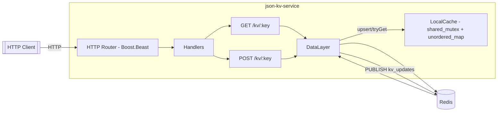
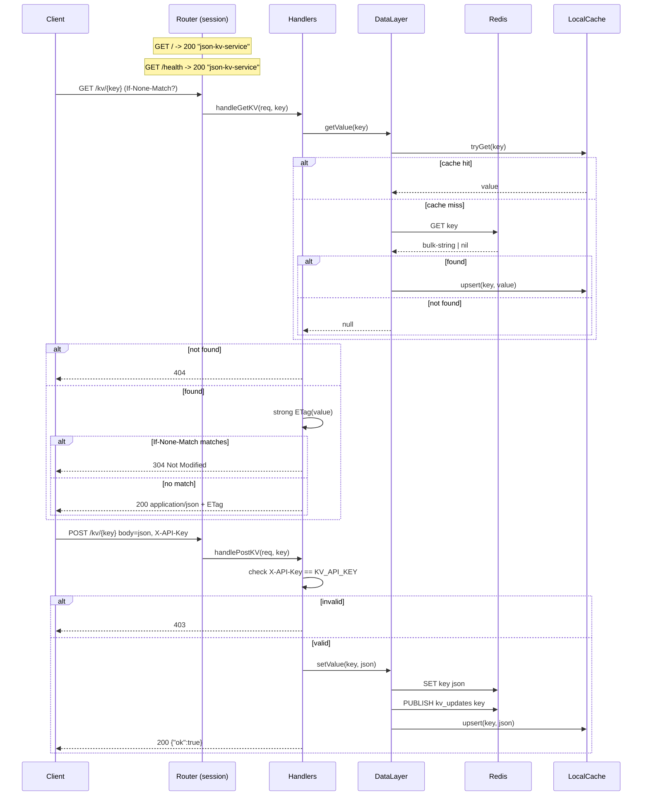
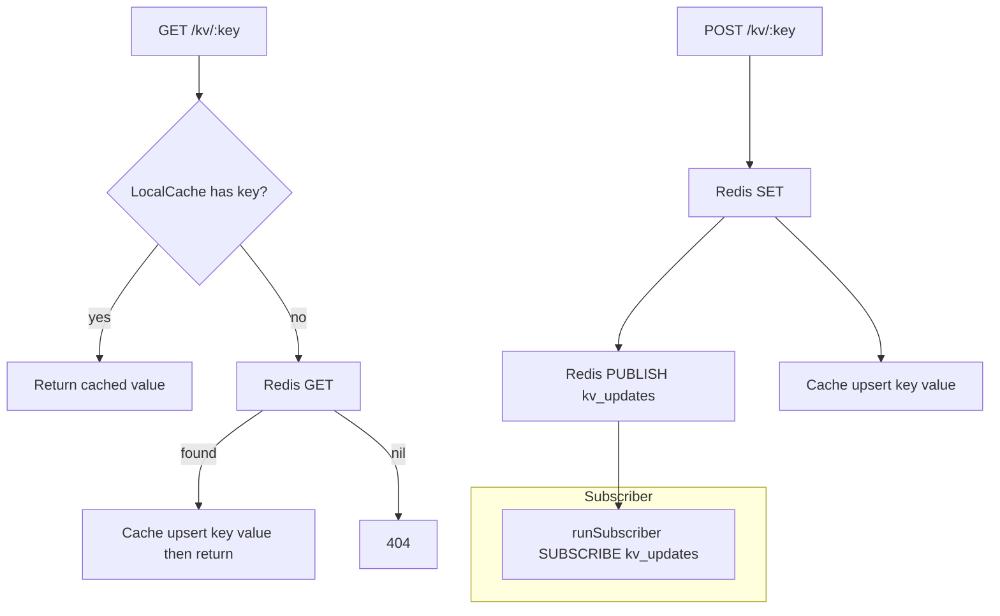

## KISS Key Value Store

A minimal asynchronous JSON key-value HTTP service backed by Redis with a local in-memory cache and pub/sub invalidation.

### Architecture Overview


- **Router**: parses requests and dispatches to handlers.
- **DataLayer**: mediates reads/writes to Redis, maintains the process-local cache, and runs a subscriber coroutine.
- **LocalCache**: thread-safe in-memory map using `shared_mutex` for read-heavy performance.

### Request Routing and Endpoints


- **GET /** or **GET /health**: returns `json-kv-service`.
- **GET /kv/:key**: returns JSON value or 404; supports strong `ETag` + `If-None-Match` for conditional GETs; `Cache-Control: no-cache` signals revalidation.
- **POST /kv/:key**: writes raw JSON string; requires header `X-API-Key` matching `KV_API_KEY`; returns `{ "ok": true }`.

### Cache Behavior and Invalidation


Notes:
- Cache is warmed on GET misses and on successful POSTs.
- A long-running subscriber coroutine (`runSubscriber`) subscribes to `kv_updates`; current code reads messages but ignores payloads. This is a hook for multi-replica cache invalidation if you add erase/refresh logic.

### Configuration
- **Env**: `KV_API_KEY` (required), `PORT` (default 8001), `BIND_HOST` (default 0.0.0.0), `REDIS_HOST` (default 127.0.0.1), `REDIS_PORT` (default 6379)
- **Docker**: see `docker-compose.yml` for `redis` and `app` services; the app publishes to channel `kv_updates`.

### Example Requests
```bash
# Health
curl -s http://localhost:8001/health

# Write (replace API key)
curl -s -X POST http://localhost:8001/kv/user:42 \
  -H "X-API-Key: change_me" \
  -H "Content-Type: application/json" \
  --data '{"name":"Ada","tier":"pro"}'

# Read with conditional GET
etag=$(curl -si http://localhost:8001/kv/user:42 | awk '/^ETag:/ {print $2}')
curl -si http://localhost:8001/kv/user:42 -H "If-None-Match: $etag"
```

### Future Enhancements
- Use pub/sub messages to invalidate or refresh other replicas' caches (`LocalCache::erase`) using the key payload.
- Add TTLs or size limits to `LocalCache`.
- Input validation for POSTed JSON and optional schema enforcement.
- Structured error bodies and metrics.
