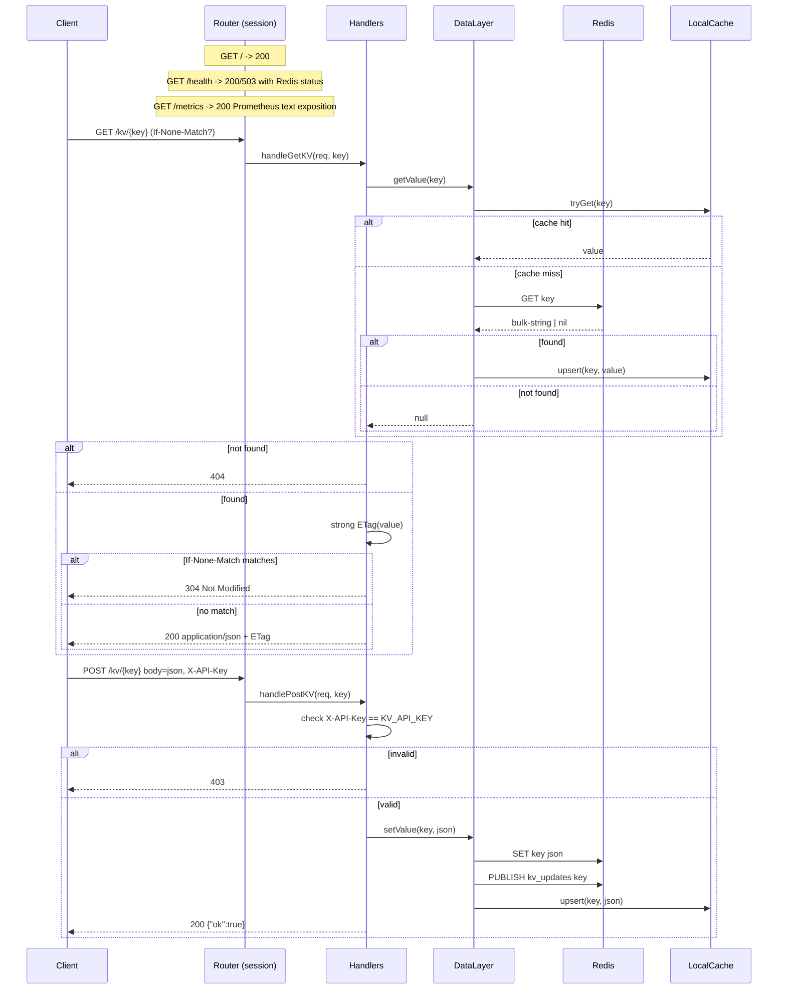
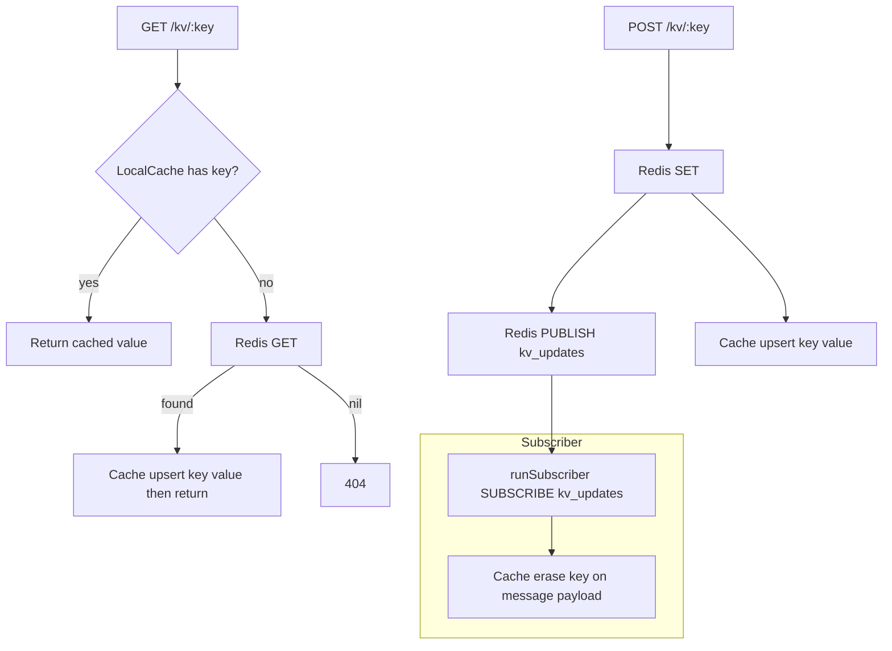

## KISS Key Value Store

A minimal asynchronous JSON key-value HTTP service backed by Redis with a local in-memory cache and pub/sub invalidation.

### Architecture Overview


- **Router**: parses requests and dispatches to handlers.
- **DataLayer**: mediates reads/writes to Redis, maintains the process-local cache, and runs a subscriber coroutine.
- **LocalCache**: thread-safe in-memory map using `shared_mutex` for read-heavy performance.

### Request Routing and Endpoints


- **GET /**: simple readiness.
- **GET /health**: liveness + Redis health; returns `{"redis":"up"}` (200) or `{"redis":"down"}` (503).
- **GET /metrics**: Prometheus metrics in text exposition format.
- **GET /kv/:key**: returns JSON value or 404; supports strong `ETag` + `If-None-Match` for conditional GETs; `Cache-Control: no-cache` signals revalidation.
- **POST /kv/:key**: writes raw JSON string; requires header `X-API-Key` matching `KV_API_KEY`; returns `{ "ok": true }`.

### Cache Behavior and Invalidation


Notes:
- Cache is warmed on GET misses and on successful POSTs.
- The subscriber (`runSubscriber`) now parses pub/sub messages and erases only the specific key from `LocalCache` using the message payload (app-level pub/sub; not using Redis keyspace notifications).

### Configuration
- **Env**: `KV_API_KEY` (required), `PORT` (default 8001), `BIND_HOST` (default 0.0.0.0), `REDIS_HOST` (default 127.0.0.1), `REDIS_PORT` (default 6379)
- **Docker**: see `docker-compose.yml` for `redis` and `app` services; the app publishes to channel `kv_updates`.

### Example Requests
```bash
# Health
curl -s http://localhost:8001/health

# Metrics
curl -s http://localhost:8001/metrics | head -n 20

# Write (replace API key)
curl -s -X POST http://localhost:8001/kv/user:42 \
  -H "X-API-Key: change_me" \
  -H "Content-Type: application/json" \
  --data '{"name":"Ada","tier":"pro"}'

# Read with conditional GET
etag=$(curl -si http://localhost:8001/kv/user:42 | awk '/^ETag:/ {print $2}')
curl -si http://localhost:8001/kv/user:42 -H "If-None-Match: $etag"
```

### Metrics
Exported at `GET /metrics` in Prometheus text format. Counters include:

- `http_requests_total` with `{route}`: `health`, `metrics`, `kv_get`, `kv_post`, `other`.
- `kv_get_requests_total`, `kv_get_hits_total`, `kv_get_misses_total`.
- `kv_source_total{source="cache"|"redis"}` to identify data source.
- `kv_set_requests_total` for POSTs.
- `cache_invalidations_total` for subscriber-driven local cache evictions.
- `redis_ping_total{status="success"|"failure"}` for health pings.

Example output:
```
# TYPE http_requests_total counter
http_requests_total 42
http_requests_total{route="health"} 5
http_requests_total{route="metrics"} 3
http_requests_total{route="kv_get"} 20
http_requests_total{route="kv_post"} 2
http_requests_total{route="other"} 12
# TYPE kv_get_requests_total counter
kv_get_requests_total 20
# TYPE kv_get_hits_total counter
kv_get_hits_total 17
# TYPE kv_get_misses_total counter
kv_get_misses_total 3
# TYPE kv_source_total counter
kv_source_total{source="cache"} 15
kv_source_total{source="redis"} 5
# TYPE kv_set_requests_total counter
kv_set_requests_total 2
# TYPE cache_invalidations_total counter
cache_invalidations_total 4
# TYPE redis_ping_total counter
redis_ping_total{status="success"} 5
redis_ping_total{status="failure"} 1
```

### Future Enhancements
- Include instance ID in pub/sub payload to skip self-invalidations.
- Add TTLs or size limits to `LocalCache`.
- Input validation for POSTed JSON and optional schema enforcement.
- Structured error bodies and histogram metrics for request latency.
